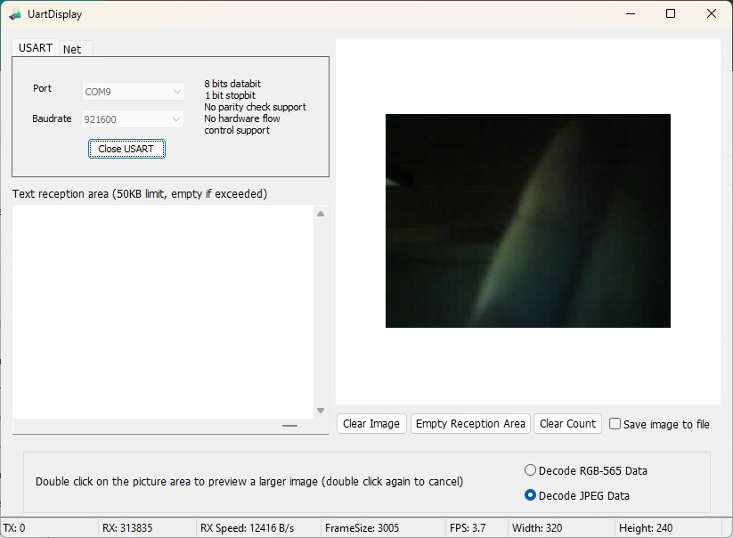

# UartNetCamDisplay

## Discription
This maybe your best debugging assistant of microcontroller's camera. By decoding the JPEG and RGB-565 (planned implementation) data streams received from serial port and network, the captured pictures in a short time are displayed in full on the software window and screenshots can be saved.

## Screenshot
